# 🏙️ 서울 문화행사 데이터를 이용한 시민 참여 트렌드 분석 대시보드

## 📖 프로젝트 소개

> 서울시에서 제공하는 문화행사 데이터를 기반으로 시민 참여 트렌드를 시각화한 데이터 분석 대시보드 프로젝트입니다. 
> 데이터 수집부터 전처리, 적재, 시각화까지의 전체 데이터 파이프라인을 구축하였습니다.


## 🚀 프로젝트 개요

> 본 프로젝트는 서울시 문화행사 데이터를 활용하여
> 시민들의 문화 참여 양상을 다양한 관점(시기·장소·유형 등)에서 분석하고
> 이를 Apache Superset 대시보드로 시각화하는 것을 목표로 합니다.

## 🧩 활용 기술 및 프레임워크
- **데이터 수집 및 정제:** 	Python, CSV
- **데이터 저장 및 관리:** 	AWS S3, Amazon Redshift
- **시각화 및 배포 환경:** 	Docker, Apache Superset


## ⚙️ 프로젝트 과정

```mermaid
graph LR
A[데이터 수집 및 추출] --> B[데이터 전처리]
B --> C[S3 저장]
C --> D[Redshift 데이터 적재 및 DB 설계]
D --> E[분석용 테이블 구축]
E --> F[Superset 시각화]
```

1. **데이터 수집 및 추출**
- 서울 열린데이터광장에서 문화행사 API 활용

2. **데이터 전처리**
- Python으로 중복/결측치 처리 및 형식 정규화

3. **데이터 저장 (S3)**
- 정제된 데이터를 AWS S3 버킷에 업로드

4. **데이터 적재 및 DB 설계 (Redshift)**
- ETL 스크립트로 S3 → Redshift 데이터 적재

5. **분석용 테이블 구축**
- Star Schema 기반으로 fact/dimension 테이블 구성

6. **시각화 (Superset)**
- Docker로 Superset 환경 구성 후 Redshift 연결 및 대시보드 제작

## 🧱 데이터베이스 설계
📊 Fact-Dimension 기반의 Star Schema 구조

>팩트–디멘션 구조를 사용하여, 팩트 테이블에서 행사 주요 정보를 중심으로
>다양한 속성(날짜, 장소, 카테고리)을 자유롭게 조합해 분석할 수 있습니다.
>즉, 데이터 관리 중심이 아닌 분석 중심 구조로,
>확장성과 조회 성능이 뛰어납니다.

## 📂 프로젝트 구조

```
project-root/
├── data/                  # 원본 및 정제된 데이터 저장
├── docker/
│   └── superset/          # Superset Docker 환경 설정 파일
├── queries/
│   ├── adhoc/             # 테스트용 SQL 쿼리
│   ├── bi/                # 분석용 테이블 작성 쿼리
│   └── fact_table/        # 팩트 테이블 작성 쿼리
└── src/
    ├── bi/                # 분석용 테이블 생성 스크립트
    ├── common/            # SQL 로더, Redshift 연결 등 공통 기능
    ├── dataset/           # 데이터 수집 및 전처리 코드
    └── load/              # 팩트 테이블 적재 로직
```

## 🔒 환경 변수 관리

AWS 관련 자격 증명 정보(ACCESS_KEY, SECRET_KEY, BUCKET_NAME 등)는
각자 로컬 환경의 .env 파일에서 관리하였습니다.

.env 파일은 버전 관리(Git)에 포함하지 않습니다.

## 📈 시각화 결과 (Superset)

Superset을 통해 시기별·지역별 문화행사 참여 현황을 시각화한 대시보드입니다.


## how to use uv

[Features](https://docs.astral.sh/uv/getting-started/features/)

- 프로젝트에 새로운 패키지를 추가할 때:
  - `uv add <package_name>`
- 패키지를 제거할 때:
  - `uv remove <package_name>`
- 설치된 패키지 확인:
  - `uv pip list`
- .venv 환경에서 명령어 실행:
  - `uv run <command>`

## 초기 세팅

```bash
make init # Python 가상환경 생성 및 패키지 설치 (uv venv && uv sync)

make superset-init	# Superset 컨테이너 실행 + 관리자 계정(username: admin, password: admin) 생성
                    # localhost:8088로 접속하셔서 로그인되는지 확인부탁드립니다.

make superset-up	# Superset 컨테이너 실행

make superset-down	# Superset 컨테이너 중지

make superset-reset	# Superset 환경 완전 초기화 (볼륨 삭제 포함)
```

### .env
계정 정보 및 기타 민감한 설정 값은 .env 파일의 환경 변수로 관리할려고 합니다.

